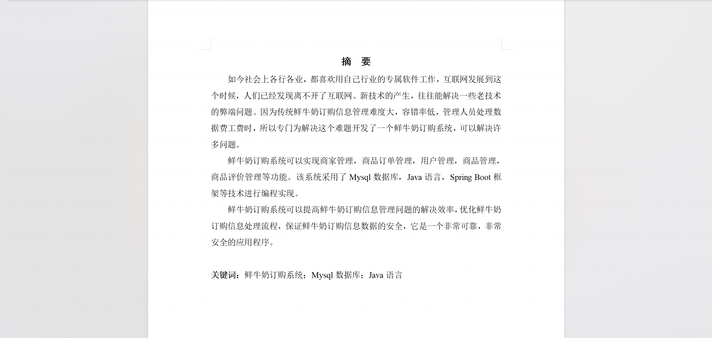
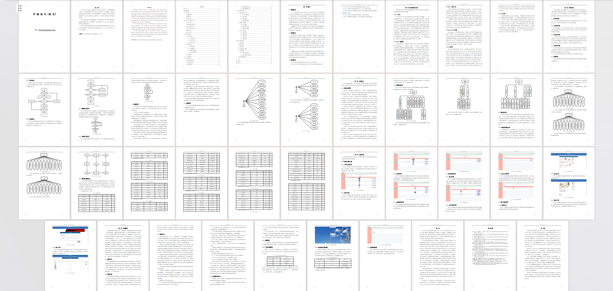
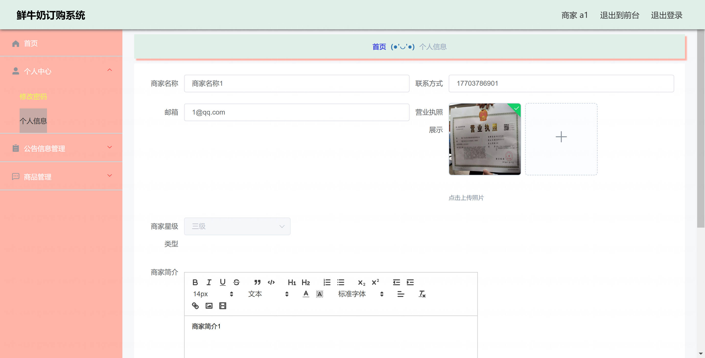
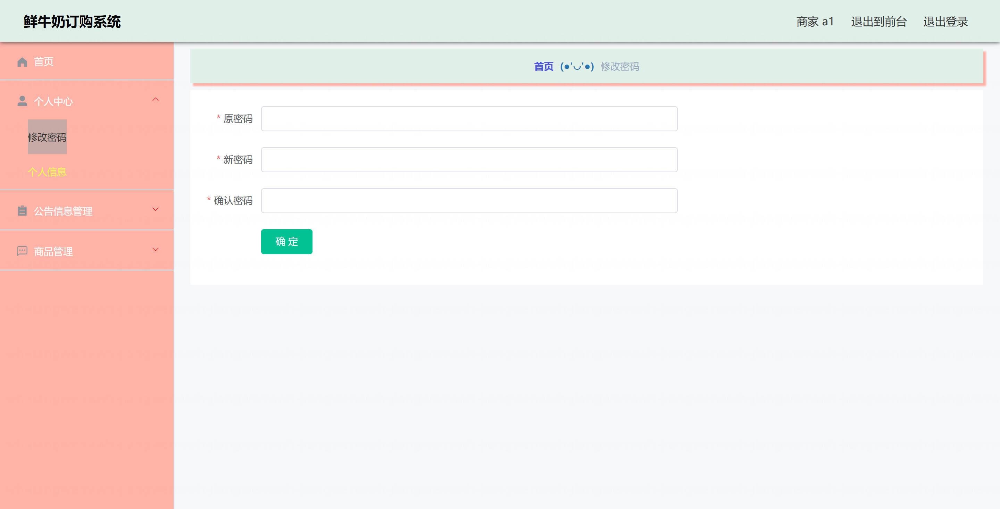
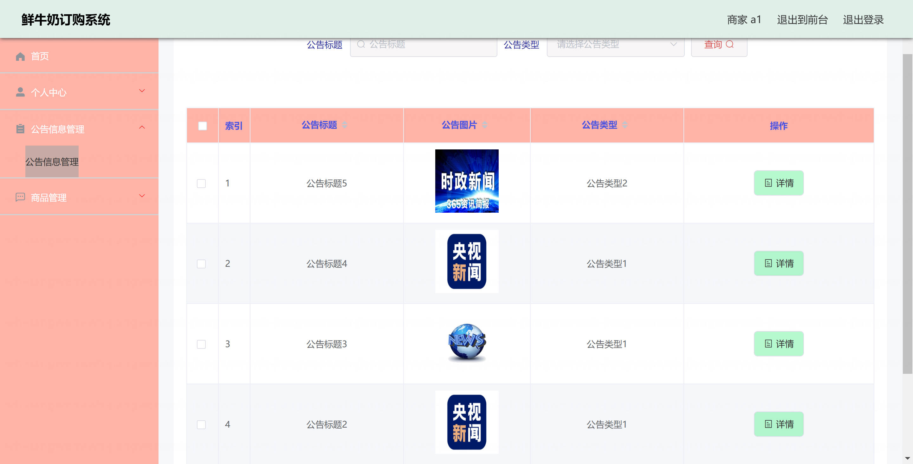
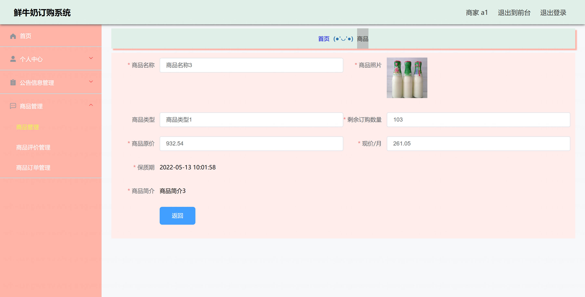
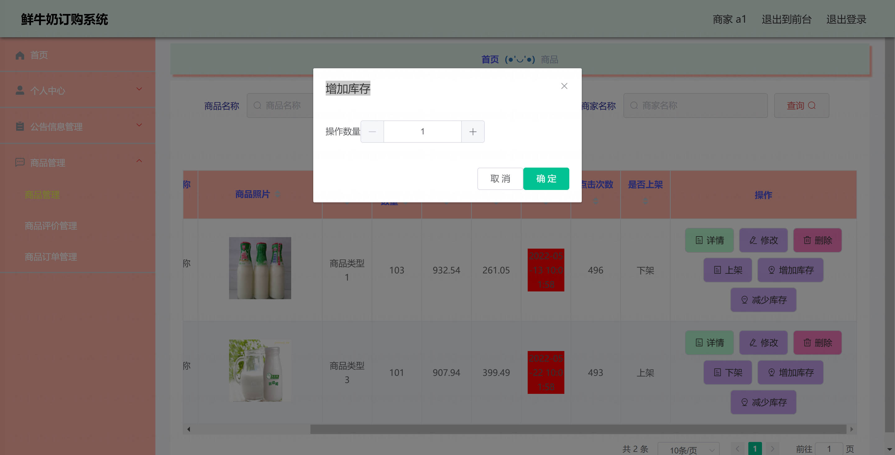
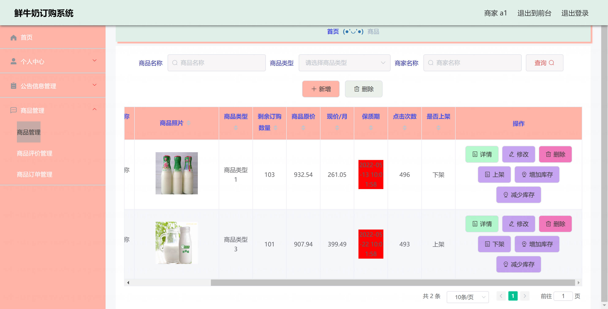
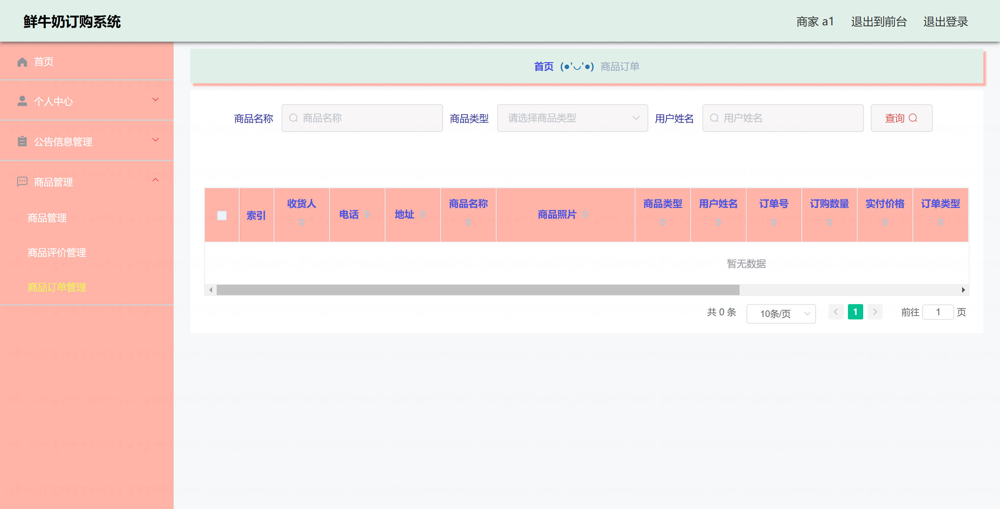
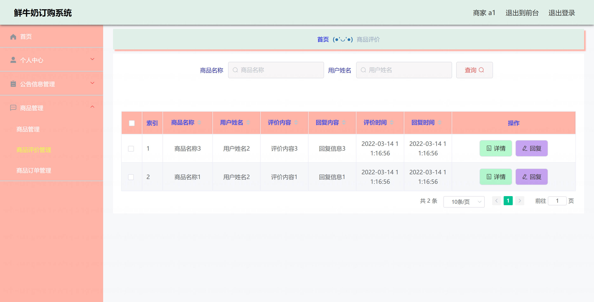

基于Springboot的鲜牛奶订购系统（程序+论文）
=

### 完整代码获取地址：从戎源码网 ([https://armycodes.com/](https://armycodes.com/))
### 作者微信：19941326836  QQ：952045282 
### 承接计算机毕业设计、Java毕业设计、Python毕业设计、深度学习、机器学习
### 选题+开题报告+任务书+程序定制+安装调试+论文+答辩ppt 一条龙服务
### 所有选题地址https://github.com/nature924/allProject

一、项目介绍
---

基于SpringBoot+Vue框架的鲜牛奶订购系统，系统角色为管理员、商家和用户，主要功能如下

管理员：
基本操作：登录、修改密码、获取个人信息、修改个人信息
管理员管理：筛选管理员、获取管理员列表、查看管理员详情、新增管理员、修改管理员、删除管理员、重置密码
公告信息管理：筛选公告、获取公告列表、查看公告详情、新增公告、修改公告、删除公告
商家管理：筛选商家、获取商家列表、查看商家详情、新增商家、修改商家、删除商家、重置密码
用户管理：筛选用户、获取用户列表、查看用户详情、新增用户、修改用户、删除用户、重置密码
商品管理：筛选商品、获取商品列表、查看商品详情、新增商品、修改商品、删除商品、上下架、增减库存
商品订单管理：获取订单列表、筛选订单、查看订单详情、删除订单、发货、退款、收货标记
商品评价管理：获取评价列表、筛选评价、查看评价详情、删除评价、回复评价
商品收藏管理：获取收藏列表、筛选收藏、查看收藏详情、删除收藏
购物车管理：筛选购物车、获取购物车列表、查看购物车详情、新增记录、修改记录、删除记录
送货地址管理：筛选地址、获取地址列表、查看地址详情、新增地址、修改地址、删除地址、设置默认地址
轮播图信息：新增轮播图、获取轮播图列表、查看轮播图详情、修改轮播图、删除轮播图
公告类型管理：查看、筛选、新增、修改、删除

商家：
基本操作：登录、修改密码、获取个人信息、修改个人信息
公告信息管理：获取公告列表、查看公告详情
商品管理：筛选商品、获取商品列表、查看商品详情、新增商品、修改商品、删除商品、上下架、增减库存
商品评价管理：获取评价列表、查看评价详情、回复评价
商品订单管理：获取订单列表、查看订单详情、发货、订单查询

用户：
基本操作：登录、修改密码、获取个人信息、修改个人信息
公告信息管理：获取公告列表、查看公告详情
商品管理：查看商品列表、查看商品详情
购物车管理：添加到购物车、查看购物车、修改数量、删除、下单结算
送货地址管理：新增地址、设置默认地址、查看地址、修改地址、删除地址
商品订单管理：提交订单、查看订单、申请退款、确认收货、订单评价
商品收藏管理：查看收藏列表、取消收藏
商品评价管理：查看评价列表、删除评价

二、项目技术
---
- 编程语言：Java
- 数据库：MySQL
- 项目架构：B/S架构
- 前端技术：JSP
- 后端技术：Spring、SpringMVC、MyBatis

三、运行环境
---
- 操作系统：Windows、macOS都可以
- JDK版本：JDK1.8以上都可以
- 开发工具：IDEA、Ecplise、Myecplise都可以
- 数据库: MySQL5.7以上都可以
- Tomcat：任意版本都可以
- Maven：任意版本都可以

四、运行截图
---
### 论文截图：

### 程序截图：

